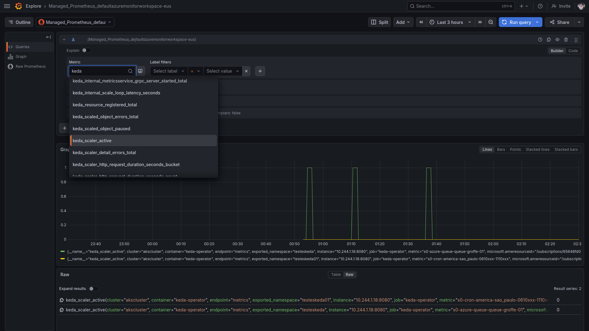
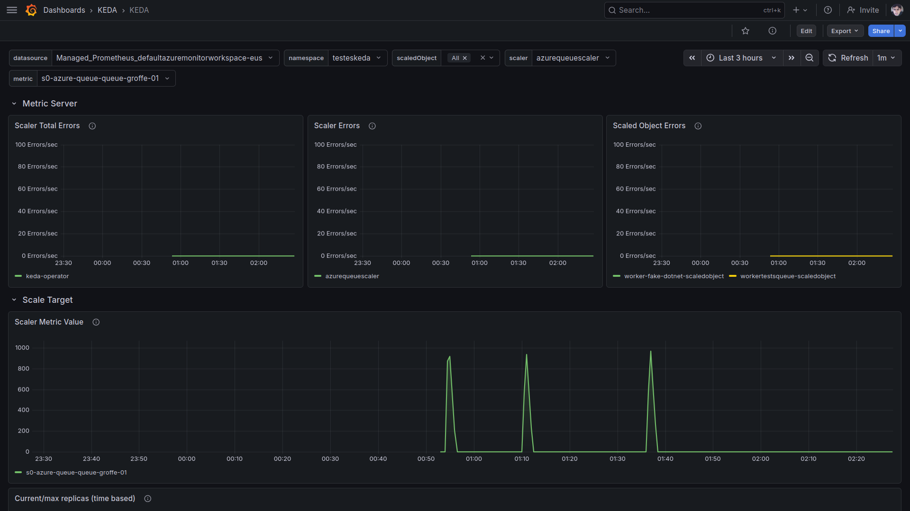
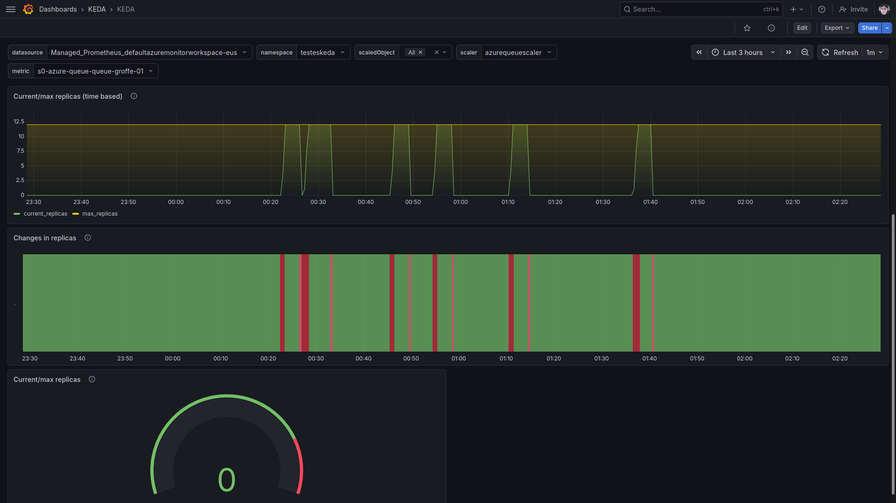

# keda_operator-aks-managed_prometheus
Instruções para configuração da coleta de métricas do KEDA Operator (escalabilidade de aplicações) em um cluster do Azure Kubernetes Service que faz uso do Azure Monitor managed service for Prometheus (Azure Managed Prometheus).

## Instruções para exportação de métricas do KEDA Operator para o Azure Managed Prometheus

Adicionando o chart Helm:

```bash
helm repo add kedacore https://kedacore.github.io/charts
helm repo update
```

Instalando o KEDA Operator num cluster do Azure Kubernetes Service, com o Prometheus gerenciado já ativado + Service Monitora desativado:

```bash
helm install keda kedacore/keda --namespace keda --create-namespace --version 2.20.2 --set prometheus.operator.enabled=true --set prometheus.operator.serviceMonitor.enabled=false
```

Para atualizar uma instalação prévia do KEDA:

```bash
helm upgrade --install keda kedacore/keda --namespace keda --create-namespace --version 2.20.2 --set prometheus.operator.enabled=true --set prometheus.operator.serviceMonitor.enabled=false
```

Será utilizado um Service Monitor customizado:

```yaml
apiVersion: azmonitoring.coreos.com/v1
kind: ServiceMonitor
metadata:
  name: keda-operator
  namespace: keda
spec:
  labelLimit: 63
  labelNameLengthLimit: 511
  labelValueLengthLimit: 1023

  selector:
    matchLabels:
      app.kubernetes.io/name: keda-operator

  endpoints:
    - port: metrics
      path: /metrics
      interval: 30s

  namespaceSelector:
    matchNames:
      - keda
```

Para aplicar isso execute:

```bash
kubectl apply -f keda-servicemonitor.yaml -n keda
```

Há instruções na documentação oficial do KEDA abordando o suporte a Prometheus, com métricas disponíveis e até um dashboard oficial para acompanhamento via Grafana: **https://keda.sh/docs/2.21/integrations/prometheus/**

As definições deste dashboard estão no GitHub: **https://github.com/kedacore/keda/blob/main/config/grafana/keda-dashboard.json**

Na imagem a seguir podemos visualizar algumas dessas métricas (incluindo detalhes de keda_scaler_active) no Prometheus:



Com o dashboard oficial podemos acompanhar os processos de scale up e scale down com o KEDA:





Dashboards criados pela comunidade e que estão no site da Grafana:
- [Keda Operator](https://grafana.com/grafana/dashboards/22111-keda-operator/)
- [Kubernetes / Autoscaling / KEDA / Scaled Object](https://grafana.com/grafana/dashboards/23951-kubernetes-autoscaling-keda-scaled-object/)


